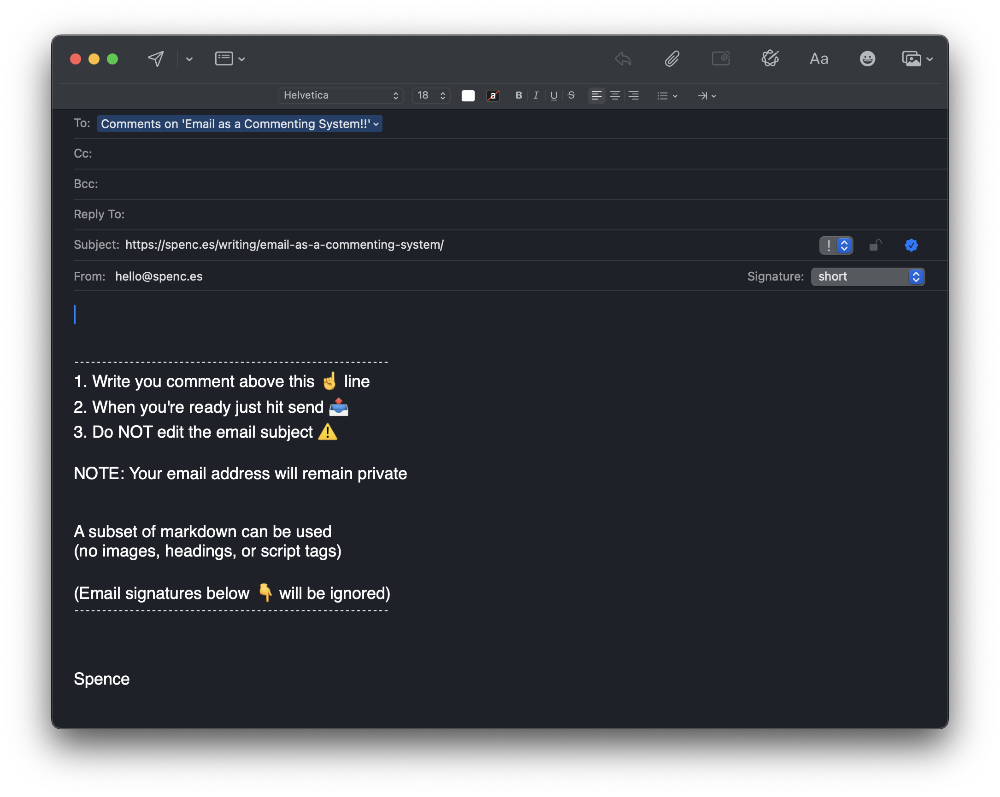

# r3ply

Receive comments via email.

Just make a `r3ply.config.toml` config file available publicly, and start receiving comments at `<your-site.com>@r3ply.com`:

```toml
version = "0.0.1"
domain = "your-site.com"
r3ply = ["r3ply.com"]

[comments.email.moderation]
type = "github"
repo = "https://github.com/you/yoursite"
file_path = "/content/comments/{{ comment.id }}.md"
```

## Usage

Read the [getting started](#getting-started) to jump right, or view individual topics for more detailed info.

### Getting Started

To use `r3ply` to receive comments on your website you only have to add a r3ply config file. It is also recommended that you moderate comments when they come in.

Here is an overview of the flow of data:

1. User sends an email addressed to your site, e.g. `spenc.es@r3ply.com`.
2. The email arrives at the email handler from your config, e.g. `r3ply.com`
3. Then the email is processed into a comment and sent to your moderation

The details of what happens along the way depends on your configuration, but that is the general flow. Read on to get more specific information.

### Receiving Comments

There are a few things to be aware of when receiving comments.

**First, specify a r3ply server in your config**. For example, using `r3ply.com` is fine, but you can also choose different ones, or even run your own.

**Also, use [`mailto`](https://en.wikipedia.org/wiki/Mailto) links on you website to create an email template for a visitor to leave a comment. E.g.**



_(the [CLI](#cli) tool can help you with generating mailto links)_

That way, sending a comment is as easy for your site's visitors as clicking a button.

**Finally _where_ the comments will actually go depends on the `moderation` part of your config.** For static sites on github the easiest is approach is to just use `github` moderation. This means comments will be arrive as a pull request in the repo you've specified in the config.

## Configuration

The following locations are checked (in priority order):

1. `https://<your-site>/.well-known/r3ply/config.{toml,json}`
1. `https://<your-site>/.well-known/r3ply.config.{toml,json}`
1. `https://<your-site>/r3ply.config.{toml,json}`

### Moderation

## CLI

```
# print usage
re

# see cmds for working with r3ply config
re config

# validate r3ply config (use --config <path> for a specific config)
re config validate

# simulate receiving an email (--from, --subject, etc... can change the email)
re comments simulate-email
```

## Contributing

This is a new project and a lot of help is needed. To get involved just file an issue. Start with taking a look at the [project structure](#project-structure) and then [how to build](#installbuildtestrun).

### Project structure

This repository is a monorepo written in a mixture of Typescript and Rust. It contains all the pieces needed to make this work:

- [@r3ply/lib](./packages/lib/) - the core functionality
- [@r3ply/config](./packages/config) - handles the schema definitions and their parsers
- [@r3ply/wasm](./crates/r3ply-wasm/) - consolidates the rust libraries used and exports them as functions in wasm
- [@r3ply/cli](./apps/cli) - a small CLI app to help site owners develop locally, instead of having to send actual emails
- [@r3ply/cloudflare-worker](./apps/cloudflare-worker/) - the Cloudflare email worker that receives email

### Install/Build/Test/Run

The correct order is important: _crates -> packages -> apps_. Here some commands to do this:

```sh
# do this download required dependencies
pnpm install

# this will build ALL the dependencies
# useful after initially cloning (note: `pnpm install` first)
pnpm build:all

# this will build the packages
# (faster than `pnpm build:all`)
pnpm build:pkgs

# run the tests of all the TS code (add `:watch` to run tests continuously)
pnpm test:ts

# run the cloudflare worker (or `pnpm -r --filter @r3ply/cloudflare-worker dev`)
cd apps/cloudflare-worker && pnpm dev

# to link CLI (from source)
cd packages/cli && pnpm link
# now you can use the CLI
re
```

## TODO

- [x] Add instructions on how to install/build/rest/run under [contributing](#configuration)
- [ ] Write documentation on how r3ply works and how people can use it
